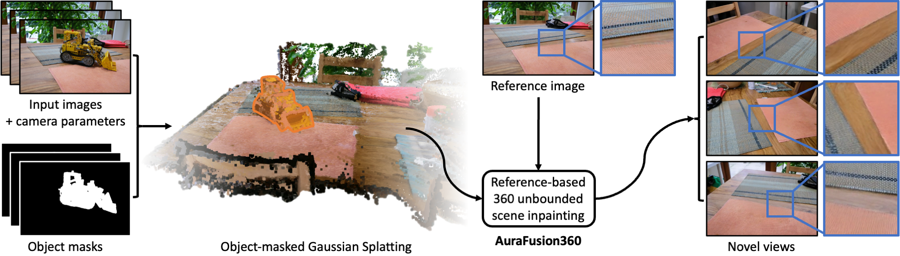

  <h2 align="center">AuraFusion360: Augmented Unseen Region Alignment for Reference-based 360° Unbounded Scene Inpainting </h2>
  

    <a href="https://kkennethwu.github.io/"><strong>Chung-Ho Wu*</strong></a>
    ·
    <a href=""><strong>Yang-Jung Chen*</strong></a>
    ·
    <a href=""><strong> Ying-Huan Chen</strong></a>
    ·
    <a href="https://jayinnn.dev/"><strong>Jie-Ying Lee</strong></a>
    ·
    <a href="https://hentci.github.io/"><strong>Bo-Hsu Ke</strong></a>
    ·
    <a href=""><strong>Chun-Wei Tuan Mu</strong></a>
    ·
    <a href=""><strong> Yi-Chuan Huang</strong></a>
    ·
    <a href="https://linjohnss.github.io/"><strong>Chin-Yang Lin</strong></a>
    ·
    <a href="https://minhungchen.netlify.app/"><strong>Min-Hung Chen</strong></a>
    ·
    <a href="https://sites.google.com/site/yylinweb/"><strong>Yen-Yu Lin</strong></a>
     
    ·
    <a href="https://yulunalexliu.github.io/"><strong>Yu-Lun Liu</strong></a>
     
     
        
        
        
        
     
    <b> NYCU |&nbsp;NVIDIA </b>
  

  <table align="center">
    <tr>
    <td>
      
    </td>
    </tr>
  </table>

## News
* **[2025.2.10]**  Release project page, arXiv paper, dataset, and evaluation results!
* **[Ongoing]** Release Code for training object-masked GS, removal, AGDD Gaussians initilaization, SDEdit Detail Enhancement, finetuning.

